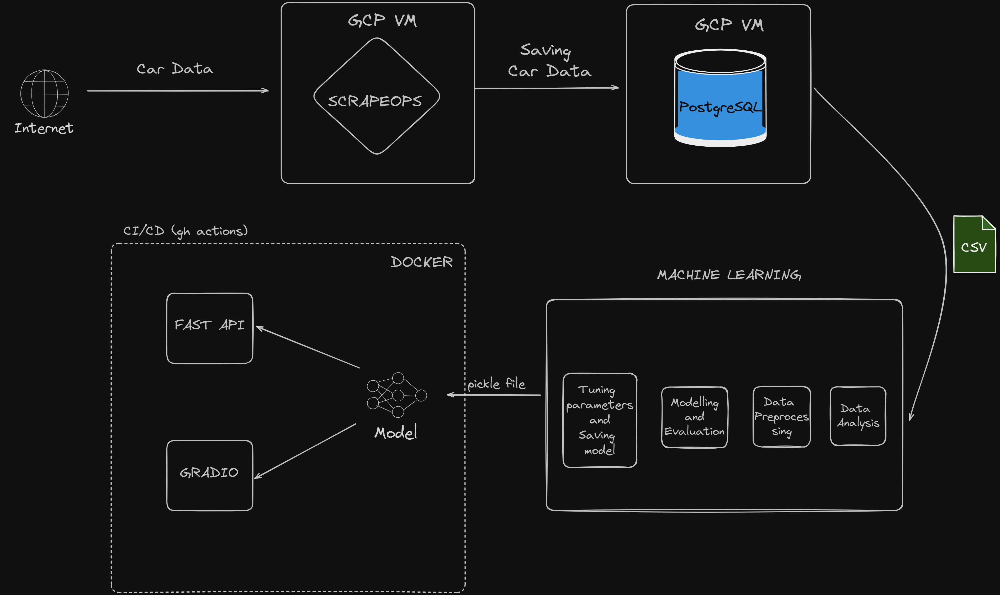

# Car Price prediction Project

https://github.com/user-attachments/assets/11dd37c1-5e6a-46e9-a297-646f11a7c7d7

This repository contains the entire journey of building a car price prediction model, from data scraping to deployment using modern tools and practices.
check out full explanation here: https://medium.com/@chidubemndukwe/ml-from-data-scraping-to-deployment-fa7ddc5fab5c



## Project Overview

* Data Scraping

    * Scrapy: Developed a web scraper to extract car data, saved it as CSV.
    * PostgreSQL: Hosted the scraped data on a local PostgreSQL database.
    * GCP VM Instance: Deployed the scraper using ScrapeOps, scheduled to run daily at midnight.
    * Data Curation: Stopped the scraper upon reaching a sufficient number of entries.

* Machine Learning

    * Imported data from PostgreSQL to local storage.
    * Performed data analysis and preprocessing.
    * Built and evaluated the machine learning model.
    * Fine-tuned the model and saved it as a pickle file.

* FastAPI

Created an API for the model to process new data and make predictions.
Hosted the API on port 8000.

* Gradio

    * Designed a simple UI for visualization purposes.

* Docker

    * Dockerized the API and Gradio app into a single container.
    * Pushed the container to Docker Hub.

* GitHub Actions

    * Configured CI/CD to build and push Docker images on PR to the main branch.

Repo Structure

``` sh
car_pred_project
│   .dockerignore
│   .env
│   .gitignore
│   compose.yaml
│   Dockerfile
│   poetry.lock
│   pyproject.toml
│   README.md
│   requirements.txt
│   supervisord.conf
│
├───.github
│   └───workflows
│           docker-image.yml
│
├───car_pred
│   │   gradio_app.py
│   │   main.py
│   │   model.py
│   │   README.Docker.md
│   │   __init__.py
│   │
│   ├───data
│   │       car_data.csv
│   │
│   ├───model
│   │       car_prediction_model.pickle
│   │
│   ├───notebooks
│   │       import_data.ipynb
│   │       main.ipynb
│
└───tests
        __init__.py

```

## Getting Started 

### Prerequisites

* Docker
* Python 
* PostgreSQL 
* Poetry

### 💻 Local Development

```sh
git clone https://github.com/Duks31/car_price-prediction 
cd car_price-prediction
poetry install
```

#### Fast API

```sh
uvicorn car_pred.main:app --reload
```
This will start the FastAPI server on `http://localhost:8000/`

#### Gradio

```sh
python car_pred/gradio_app.py
```
This will start the FastAPI server on `http://localhost:7860/`


### 🐋 Docker compose

#### Windows
```sh
git clone https://github.com/Duks31/car_price-prediction    
mkdir car_pred_project
cd car_pred_project
curl -o docker-compose.yml https://raw.githubusercontent.com/Duks31/car_price-prediction/main/compose.yaml
docker-compose up --build
```

#### Linux/macOS
```sh
git clone https://github.com/Duks31/car_price-prediction
cd car_price-prediction
wget -O docker-compose.yml https://raw.githubusercontent.com/Duks31/car_price-prediction/main/compose.yaml
docker-compose up --build
```


## CI/CD with github actions
The GitHub Actions workflow is configured to build and push the Docker image to Docker Hub whenever a pull request is made to the main branch i.e. an update to the model.

The workflow file is located at `.github/workflows/docker-image.yml`.

## Contributing

The projcet and model is definitely not perfect. Pull requests are welcome. For major changes.

## License

This project is licensed under the MIT License. See the `LICENSE` file for more details.

